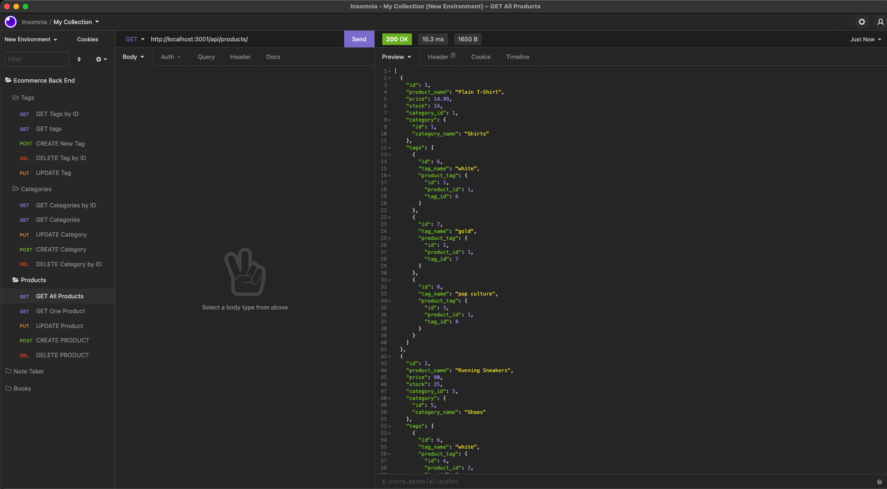

# Ecommerce Back End

## Description

This project was to create a back end for an ecommerce site by modifying code and configuring a working EXpress.js API to use Swquelize to interact with a MySQL database.

- [Installation](#installation)
- [Usage](#usage)
- [Credits](#credits)
- [License](#license)

## Installation

The indivial files can be accessed through my personal GitHub repository located: https://github.com/DanielWestiner/ecommerce-back-end.  The files can be downloaded and ran after creating a .env file with the database name, MySQL password and username.  Source the schema and seed files to use the database.

## Usage

The files can be viewed using any desktop browser for viewing.

## Credits

Collaborators on this project include the UPENN bootcamp cohort, teaching staff, and tutor Alexis San Javier who helped make edits to this project. Some concepts and syntax tips were learned from Colt Steele and his Udemy Bootcamp course.

## License

MIT License

Copyright (c) [2021] [Daniel Westiner]

Permission is hereby granted, free of charge, to any person obtaining a copy
of this software and associated documentation files (the "Software"), to deal
in the Software without restriction, including without limitation the rights
to use, copy, modify, merge, publish, distribute, sublicense, and/or sell
copies of the Software, and to permit persons to whom the Software is
furnished to do so, subject to the following conditions:

The above copyright notice and this permission notice shall be included in all
copies or substantial portions of the Software.

---